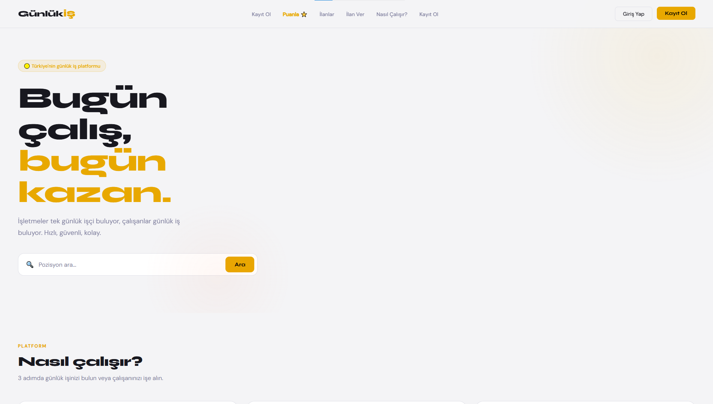
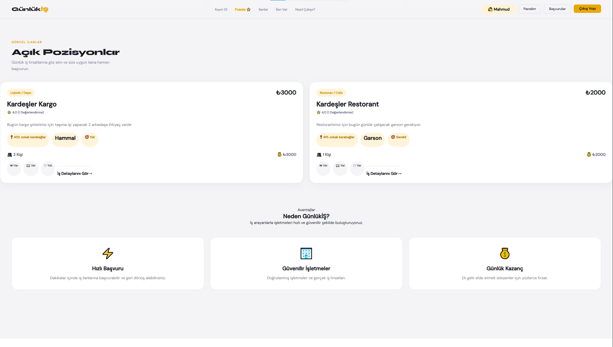
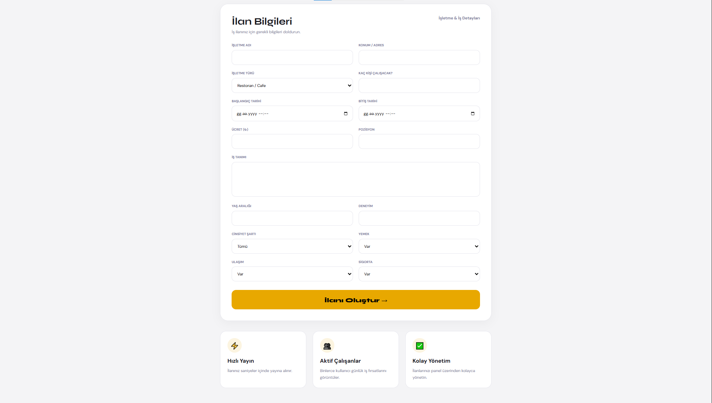
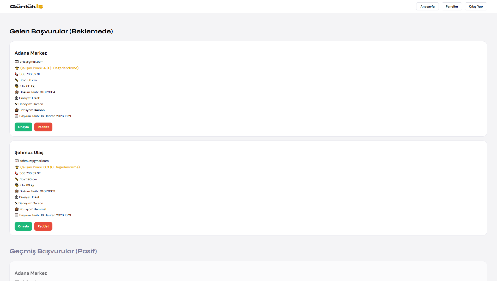
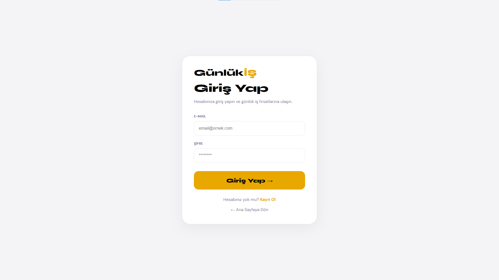
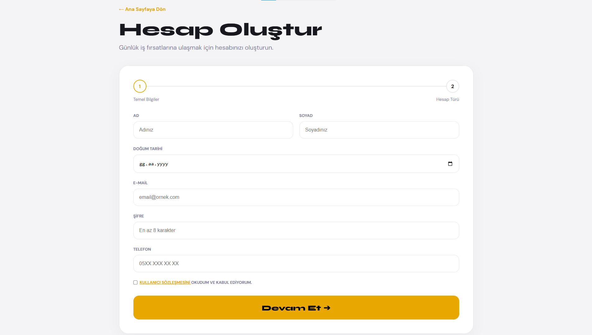
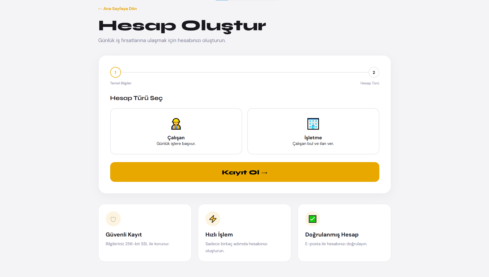
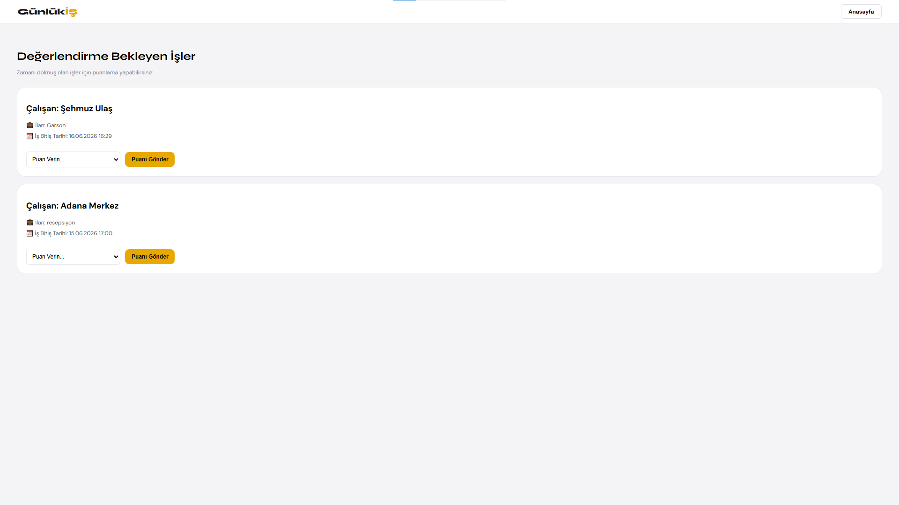
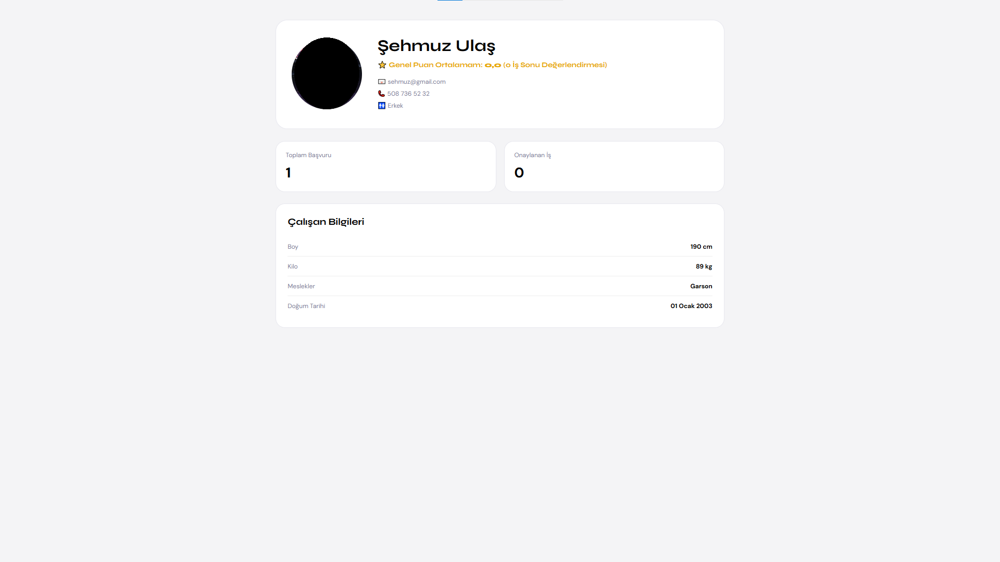

# Günlük İş İlanı ve Çalışan Eşleştirme Platformu

Ege Üniversitesi Bilgisayar Programcılığı bitirme projesi kapsamında geliştirilmiştir.

## Proje Hakkında

Bu proje, işletmeler ile günlük iş arayan çalışanları bir araya getirmek amacıyla geliştirilmiş web tabanlı bir platformdur.

İşletmeler günlük iş ilanları oluşturabilir, çalışanlar ise bu ilanlara başvurabilir. İş sonunda çalışanlar işletmeleri, işletmeler de çalışanları puanlayabilir.

Bu proje Ege Üniversitesi Bilgisayar Programcılığı bitirme projesi kapsamında geliştirilmiş ve 90/100 not ile başarılı bulunmuştur.

## Özellikler

### Kullanıcı Yönetimi

* Kullanıcı kayıt sistemi
* Kullanıcı giriş sistemi
* Çalışan ve işletme kullanıcı rolleri

### İşletme İşlemleri

* İş ilanı oluşturma
* İş ilanı düzenleme
* Başvuruları görüntüleme
* Çalışan kabul/red işlemleri

### Çalışan İşlemleri

* İlanları görüntüleme
* İş ilanlarına başvurma
* Başvuru durumlarını takip etme

### Puanlama Sistemi

* İşletmenin çalışanı puanlaması
* Çalışanın işletmeyi puanlaması
* Ortalama puan hesaplama ve görüntüleme

## Kullanılan Teknolojiler

* Python
* Django
* SQL
* HTML
* CSS

## Veritabanı Yapısı

Projede temel olarak aşağıdaki yapılar bulunmaktadır:

* Kullanıcılar
* Çalışan Profilleri
* İşletme Profilleri
* İş İlanları
* Başvurular
* Değerlendirmeler (Puanlamalar)

## Proje Görselleri

## Home Page

## Job Listings

## Create Job Posting

## Application Management

## Login Page

## Registration Page

## Rating System

## User Profile

## Geliştiriciler

* Mahmoud Anis
* Duru Talı
* Elif Ünal
* Mehmet Ali Aktan

Ege Üniversitesi Meslek Yüksekokulu Bilgisayar Programcılığı